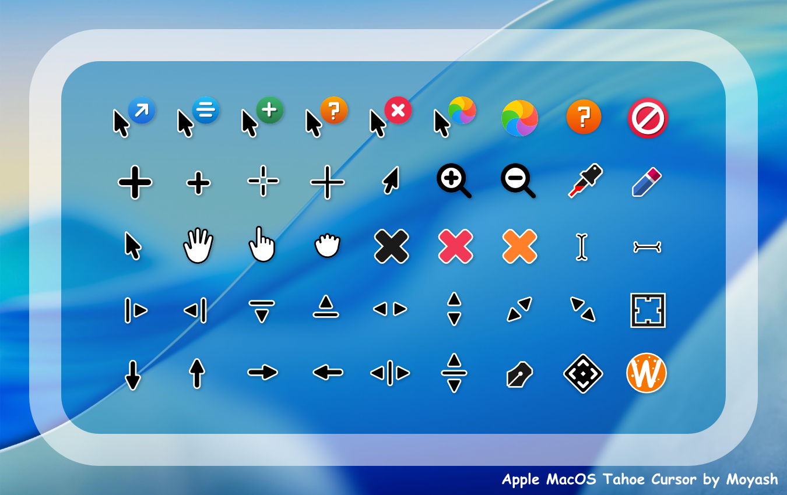

# MacOS-Tahoe-Cursor

Collect the package files of MacOS-Tahoe-Cursor.

### links
* [KDE Store](https://store.kde.org/p/2300466)
* [Gnome Store](https://www.gnome-look.org/p/2300466)

# The following content comes from the original author

MacOS Tahoe Cursor (vr 1.1) for Linux.

Created by MOYASH.
------------------

to install:

1-Move "MacOS-Tahoe-Cursor" folder to the ".icons" folder in your "Home" directory.

2-Then Choose and Apply the Cursor Name.
---------------------------------------

License:(CC BY-NC-ND).
---------------------

Support Creator: ($3.0 or more)

**Buy a Coffee for MOYASH**

ko-fi.com/moyash

buymeacoffee.com/moyash

***** Direct Donation via PayPal *****
paypal.me/MOYASH77
----------------------------------------------------------

Thanks for Downloading my Work.
Copyright 2025 Moyash, All right reserved.
-----------------------------------------------------
